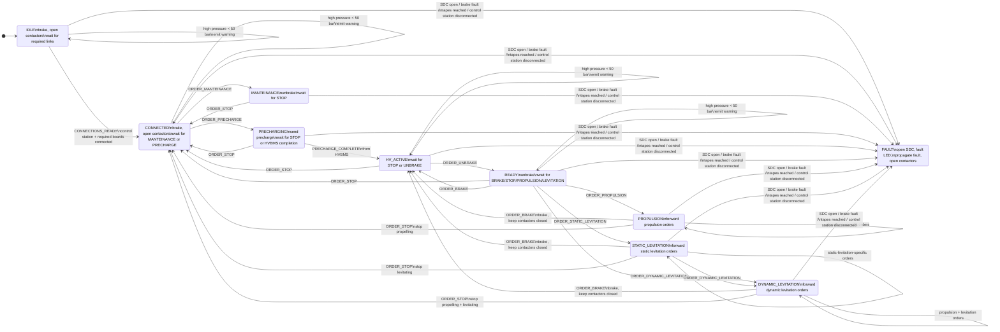

# VCU State Machine Diagram

This diagram follows `docs/vcu_state_machine.yaml`.

```mermaid
stateDiagram-v2
    direction LR

    [*] --> IDLE

    IDLE: IDLE\nbrake, open contactors\nwait for required links
    CONNECTED: CONNECTED\nbrake, open contactors\nwait for MANTEINANCE or PRECHARGE
    MANTEINANCE: MANTEINANCE\nunbrake\nwait for STOP
    PRECHARGING: PRECHARGING\nsend precharge\nwait for STOP or HVBMS completion
    HV_ACTIVE: HV_ACTIVE\nwait for STOP or UNBRAKE
    READY: READY\nunbrake\nwait for BRAKE/STOP/PROPULSION/LEVITATION
    PROPULSION: PROPULSION\nforward propulsion orders
    STATIC_LEVITATION: STATIC_LEVITATION\nforward static levitation orders
    DYNAMIC_LEVITATION: DYNAMIC_LEVITATION\nforward dynamic levitation orders
    FAULT: FAULT\nopen SDC, fault LED,\npropagate fault, open contactors

    IDLE --> CONNECTED: CONNECTIONS_READY\ncontrol station + required boards connected

    CONNECTED --> MANTEINANCE: ORDER_MANTEINANCE
    CONNECTED --> PRECHARGING: ORDER_PRECHARGE

    MANTEINANCE --> CONNECTED: ORDER_STOP

    PRECHARGING --> CONNECTED: ORDER_STOP
    PRECHARGING --> HV_ACTIVE: PRECHARGE_COMPLETE\nfrom HVBMS

    HV_ACTIVE --> CONNECTED: ORDER_STOP
    HV_ACTIVE --> READY: ORDER_UNBRAKE

    READY --> CONNECTED: ORDER_STOP
    READY --> HV_ACTIVE: ORDER_BRAKE
    READY --> PROPULSION: ORDER_PROPULSION
    READY --> STATIC_LEVITATION: ORDER_STATIC_LEVITATION
    READY --> DYNAMIC_LEVITATION: ORDER_DYNAMIC_LEVITATION

    STATIC_LEVITATION --> DYNAMIC_LEVITATION: ORDER_DYNAMIC_LEVITATION

    PROPULSION --> HV_ACTIVE: ORDER_BRAKE\nbrake, keep contactors closed
    STATIC_LEVITATION --> HV_ACTIVE: ORDER_BRAKE\nbrake, keep contactors closed
    DYNAMIC_LEVITATION --> HV_ACTIVE: ORDER_BRAKE\nbrake, keep contactors closed

    PROPULSION --> CONNECTED: ORDER_STOP\nstop propelling
    STATIC_LEVITATION --> CONNECTED: ORDER_STOP\nstop levitating
    DYNAMIC_LEVITATION --> CONNECTED: ORDER_STOP\nstop propelling + levitating

    PROPULSION --> PROPULSION: propulsion-specific orders
    STATIC_LEVITATION --> STATIC_LEVITATION: static-levitation-specific orders
    DYNAMIC_LEVITATION --> DYNAMIC_LEVITATION: propulsion + levitation orders

    IDLE --> IDLE: high pressure < 50 bar\nemit warning
    CONNECTED --> CONNECTED: high pressure < 50 bar\nemit warning
    HV_ACTIVE --> HV_ACTIVE: high pressure < 50 bar\nemit warning
    READY --> READY: high pressure < 50 bar\nemit warning

    IDLE --> FAULT: SDC open / brake fault /\ntapes reached / control station disconnected
    CONNECTED --> FAULT: SDC open / brake fault /\ntapes reached / control station disconnected
    MANTEINANCE --> FAULT: SDC open / brake fault /\ntapes reached / control station disconnected
    PRECHARGING --> FAULT: SDC open / brake fault /\ntapes reached / control station disconnected
    HV_ACTIVE --> FAULT: SDC open / brake fault /\ntapes reached / control station disconnected
    READY --> FAULT: SDC open / brake fault /\ntapes reached / control station disconnected
    PROPULSION --> FAULT: SDC open / brake fault /\ntapes reached / control station disconnected
    STATIC_LEVITATION --> FAULT: SDC open / brake fault /\ntapes reached / control station disconnected
    DYNAMIC_LEVITATION --> FAULT: SDC open / brake fault /\ntapes reached / control station disconnected
```
